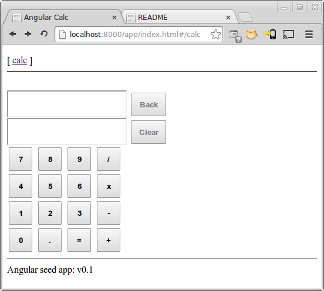

# angular-calc

* A basic calculator made in [AngularJS](http://angularjs.org/), hosted on [NodeJS](http://nodejs.org/)

### Running the app during development

You can pick one of these options:

* serve this repository with your webserver
* install node.js and run `scripts/web-server.js`

Then navigate your browser to `http://localhost:<port>/app/index.html` to see the app running in
your browser.

### angular-seed — the seed for AngularJS apps

* The application skeleton was made by Angular-Seed

